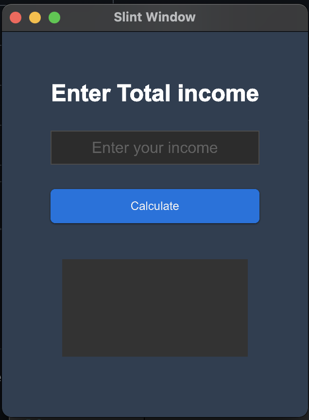
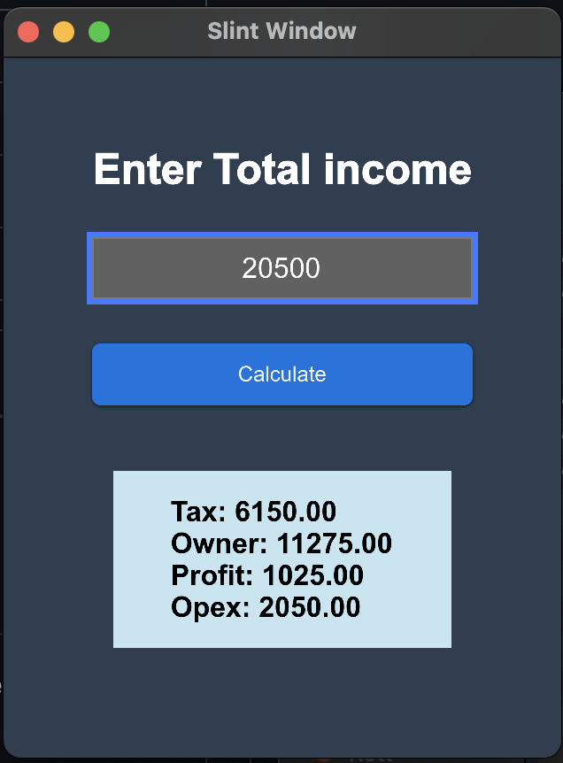

# Slint⚡️ Rust🦀 simple Income Calculator Desktop-App 





A template for a Rust application that's using [Slint](https://slint.rs/) for the user interface.

## About

This template provides a starting point for developing a Rust application with Slint as the user interface toolkit. It showcases the seamless integration between the `.slint` UI markup and Rust code, demonstrating how to handle callbacks, manipulate properties, and utilize basic widgets effectively.

## Usage

1. Install Rust by following the [getting-started guide](https://www.rust-lang.org/learn/get-started). Ensure that the `rustc` compiler and the `cargo` build system are installed in your `PATH`.
2. Clone the [Slint Rust Template](https://github.com/slint-ui/slint-rust-template) repository:
    ```
    git clone https://github.com/slint-ui/slint-rust-template.git
    ```
3. Rename the cloned directory and navigate into it:
    ```
    mv slint-rust-template my-project
    cd my-project    
    ```

To integrate your project with the Slint Rust Template, follow these steps:

1. Copy the contents of the `slint-rust-template-main` directory into your project directory.
2. Open the `Cargo.toml` file and update the `name` and `version` fields to match your project.
3. Replace the contents of the `src/main.rs` file with your own code.
4. Customize the UI by modifying the `.slint` files in the `src/ui` directory.
5. Build your project using `cargo`:
    ```
    cargo build
    ```
6. Run the application binary:
    ```
    cargo run
    ```
7. To create a desktop application bundle, install `cargo-bundle`:
    ```
    cargo install cargo-bundle
    ```
    Then bundle your application:
    ```
    cargo bundle --release
    ```

For more information on how to effectively use the Slint UI toolkit, refer to the [Slint documentation](https://slint.rs/).

It is recommended to use an IDE for development, along with [LSP-based IDE integration for `.slint` files](https://github.com/slint-ui/slint/blob/master/tools/lsp/README.md).
